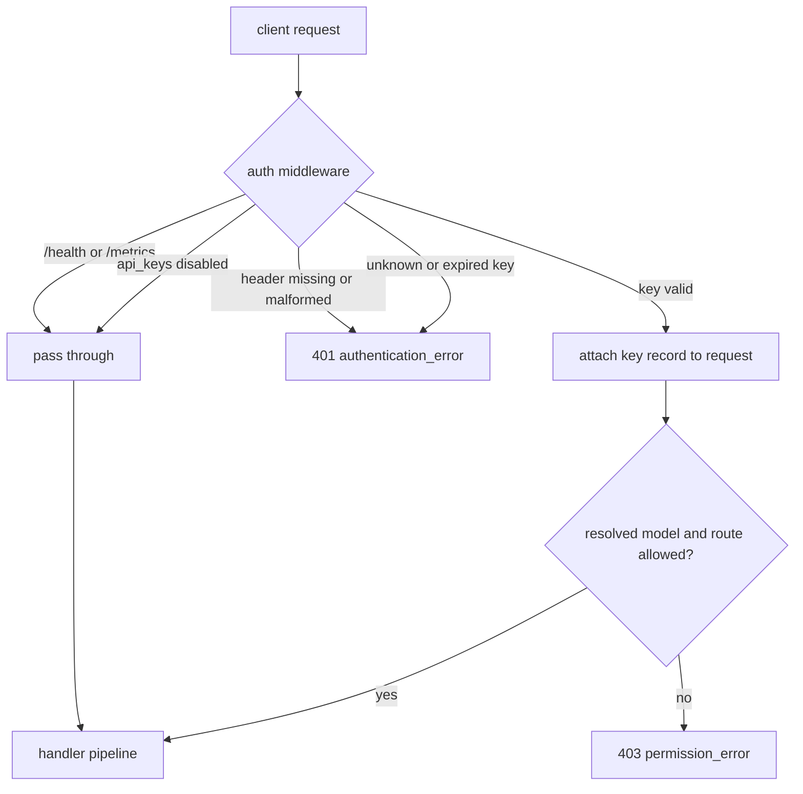

# Virtual API Keys

Virtual API keys are gateway-issued bearer tokens that identify clients and optionally restrict which models and semantic routes they may use. They are independent of upstream provider credentials: clients send a virtual key to llm-gateway, and the gateway uses its own provider credentials after the request is authorized.

Clients send the key in the standard header:

```http
Authorization: Bearer sk-gw-example
```

Existing OpenAI-compatible clients work without protocol changes. When `api_keys` is omitted or `enabled: false`, authentication is disabled and the gateway remains open.

## Inline Configuration

The smallest configuration keeps keys in the main gateway file:

```yaml
api_keys:
  enabled: true
  keys:
    - name: alice
      key: "${ALICE_GATEWAY_KEY}"
      allowed_models: ["claude-*", "gpt-*"]
      allowed_routes: ["coding", "general"]

    - name: breakglass
      key: "sk-gw-breakglass-example"
```

Inline keys are loaded once at startup and are not re-read. They are useful for a break-glass credential; use a [file or HTTP key source](key-sources.md) for keys that must be added, changed, or revoked without restarting the gateway.

The complete `api_keys` subtree is decoded strictly. Unknown fields, duplicate fields, missing required values, and values that require type coercion fail startup rather than being ignored. `${VAR}` references in inline `key` values are expanded once while the configuration loads; a non-empty reference that resolves empty is an error.

## Key Format and Storage

`llm-gateway genkey` generates a high-entropy key with the conventional `sk-gw-` prefix:

```bash
llm-gateway genkey
# sk-gw-a1b2c3d4e5f6...
```

The prefix identifies the credential to humans but is not required. A plaintext key must match the HTTP bearer-token `b64token` grammar: letters, digits, `-`, `.`, `_`, `~`, `+`, and `/`, followed by any trailing `=` padding. Whitespace, control characters, and non-ASCII values are rejected because an HTTP `Authorization` header cannot carry them reliably.

Inline configuration necessarily contains plaintext, but the resident store does not. The gateway validates and SHA-256 hashes each key while loading it, hashes each presented bearer token once, and compares digests. External sources may publish the digest directly with `key_sha256`; see [Key Sources](key-sources.md).

## Identity and Restrictions

`name` is the stable attribution identity used in request metrics and routing logs. It must be non-empty and is compared exactly: case, whitespace, and Unicode form are not normalized. Renaming a record moves future observations to a new identity. Publishing two records with one name is appropriate during a key-rotation window, but otherwise merges their attribution.

### Model Restrictions

`allowed_models` contains glob patterns in Go's `path.Match` dialect. An absent or empty list permits every model. A non-empty list permits a resolved model when any pattern matches; malformed patterns reject the key document.

The dialect treats `/` as a separator, so neither `*` nor `?` crosses it. In particular, `allowed_models: ["*"]` does **not** match a provider-namespaced model such as `meta-llama/Llama-3-70B`. Use a pattern such as `meta-llama/*`, `*/*`, or an explicit model name when slash-containing IDs should be allowed. Omitting `allowed_models` is the only spelling that is unconditionally unrestricted.

Permission is checked after semantic routing and aliases resolve to a concrete model, but before provider dispatch. A rejected model returns 403.

### Route Restrictions

`allowed_routes` contains exact semantic-route names, not patterns. An absent or empty list permits every route. When semantic routing selects a route outside the list, the gateway returns 403 rather than silently choosing a fallback. Explicit-model requests have no semantic route, so route restrictions do not reject them; the concrete-model check still applies.

## Expiry and Revocation

File and HTTP source records may carry `expires_at`. A key is expired at the timestamp's exact boundary and returns the same 401 response as an unknown key. Expiry is checked during lookup, so it does not wait for the next source refresh. Inline keys do not yet expose `expires_at`.

Revocation is deletion from a source. A source refresh installs its complete current set atomically; removing a record removes that source's claim on the next successful refresh. A request that already authenticated completes against the record it received even if a later snapshot revokes the key mid-flight.

## Authentication Flow



`/health` and `/metrics` remain unauthenticated.

## Error Responses

Errors use the OpenAI-compatible envelope:

| Scenario | Status | Error type |
|---|---:|---|
| Missing or malformed `Authorization` header | 401 | `authentication_error` |
| Unknown or expired key | 401 | `authentication_error` |
| Model not allowed | 403 | `permission_error` |
| Route not allowed | 403 | `permission_error` |

The unknown and expired cases are intentionally indistinguishable to clients.

## Logging and Metrics

The validated key name appears in semantic-routing log lines and as the `key` attribute on `llm_gateway.requests` and `llm_gateway.request.duration`. Secret values and digests are never logged. Source freshness, reload results, exclusion, and resident-record metrics are documented in [Key Sources](key-sources.md) and [Metrics](metrics.md).

## Not Yet Implemented

- Per-key filtering of `/v1/models` responses
- Expiry on inline configuration keys and advance-expiry warnings
- Plaintext-free inline configuration
- Per-key rate limiting
- Per-key token accounting and spend limits
- Cancelling in-flight work when a key is revoked
